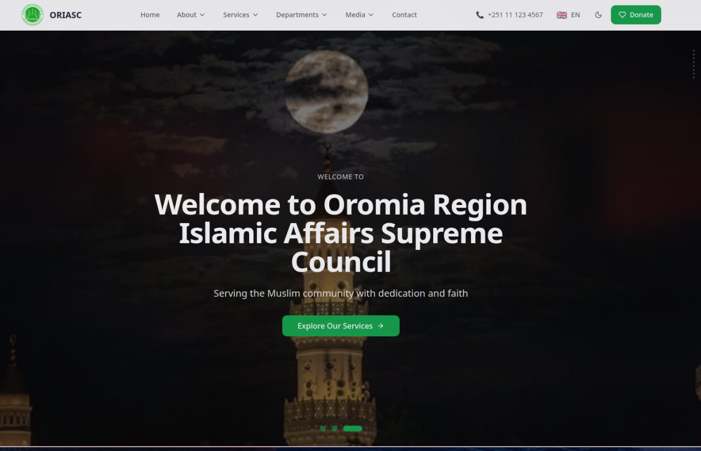
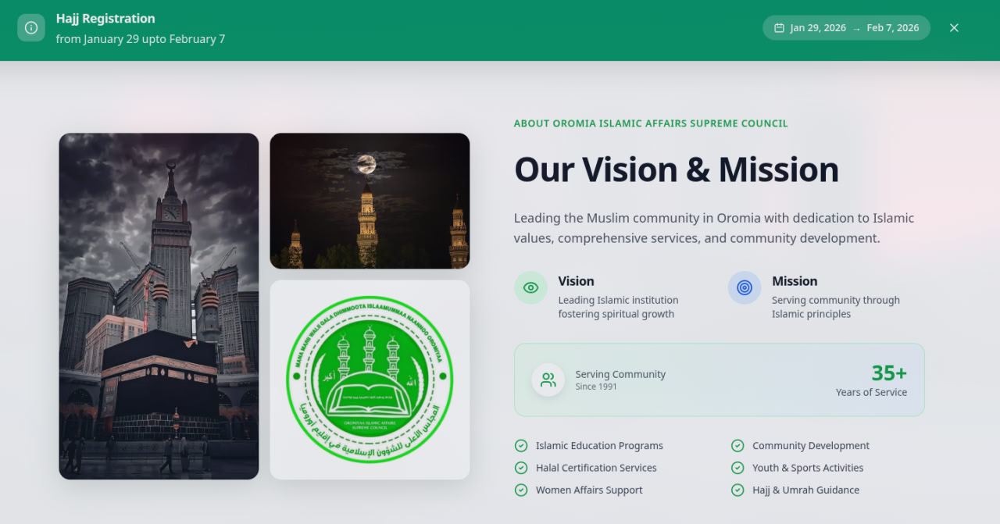
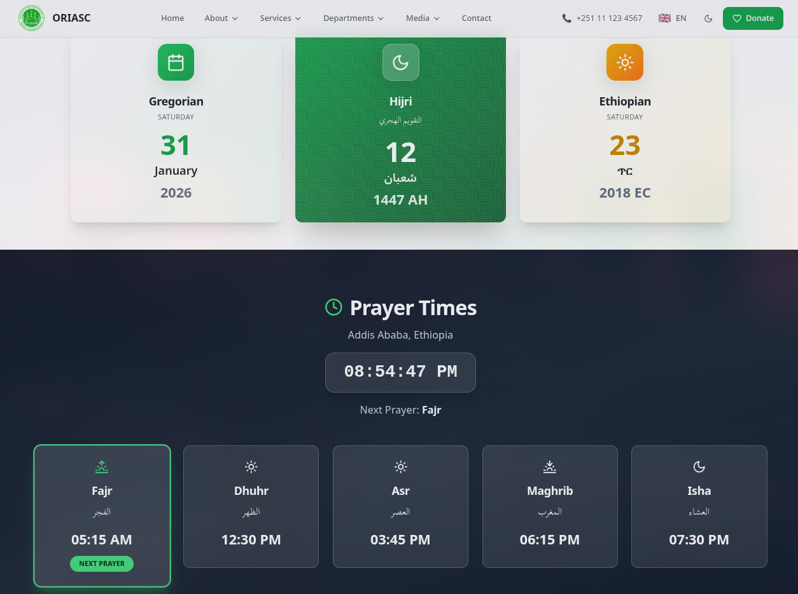

# ORIASC - Majlisa Oromiyaa Website

A full-stack web application for Majlisa Oromiyaa Islamic Center.

**Live Site:** [oriasc.org](https://oriasc.org)

## Tech Stack

### Frontend
- **React 18** - UI library
- **TypeScript** - Type-safe JavaScript
- **Vite** - Build tool and dev server
- **Tailwind CSS** - Utility-first CSS framework
- **i18n** - Multi-language support (Oromo, English, Amharic, Arabic)

### Backend
- **Laravel 11** - PHP web framework
- **MySQL** - Database
- **Laravel Sanctum** - API authentication
- **RESTful API** - API architecture

## Features

- Multi-language support
- Event management
- Gallery system
- Contact form
- Responsive design
- PWA support

## Robust Custom Dashboard

A powerful, user-friendly admin dashboard that allows non-technical admins to adjust any part of the website without writing any code.

## License

All rights reserved © 2024 Majlisa Oromiyaa
